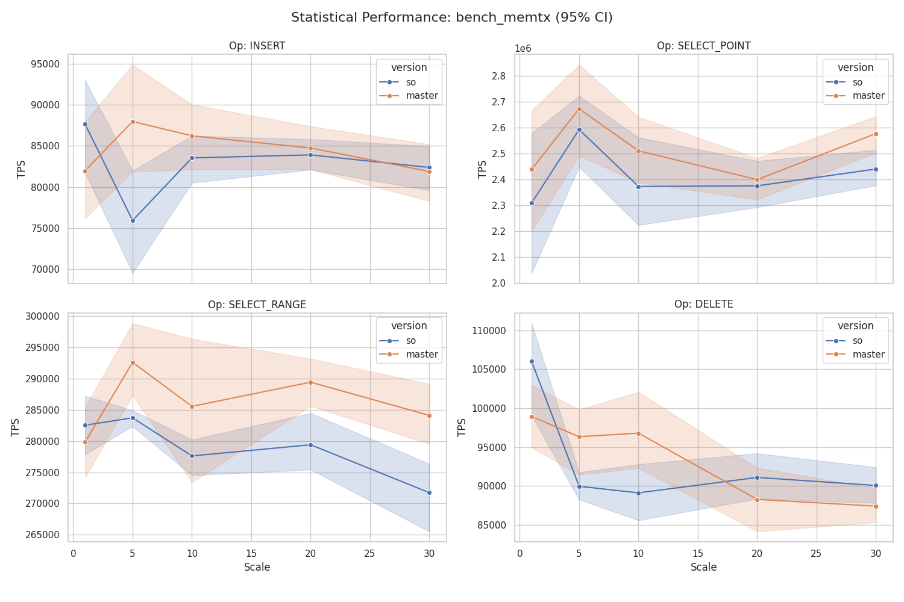
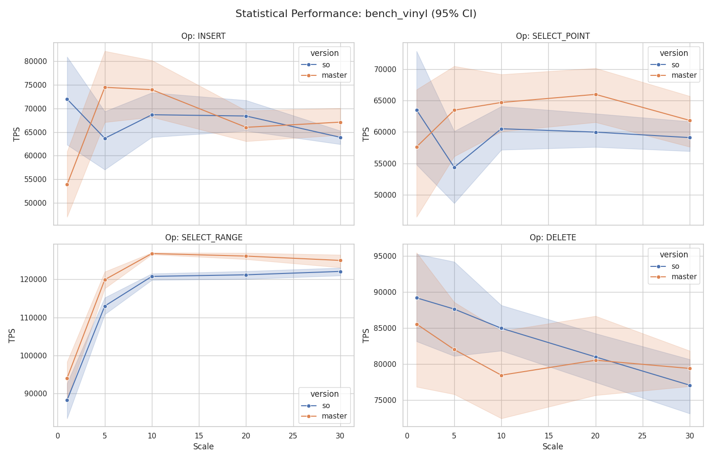
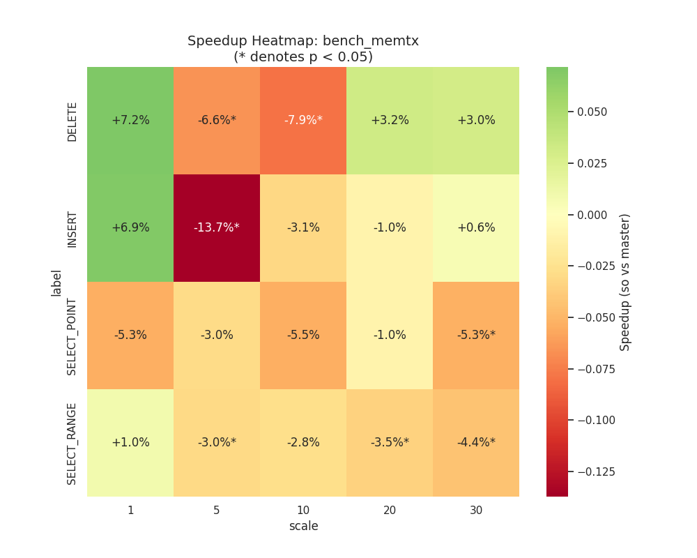
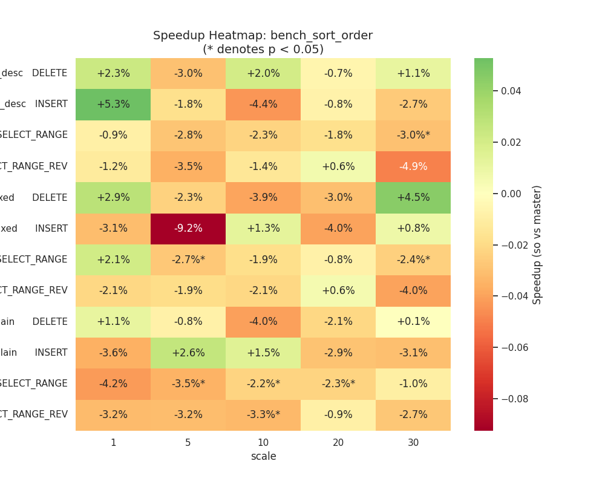

# Benchmark Report: Tarantool `sort_order` Performance Analysis

This report summarizes the performance comparison between the `master` branch and the `so` (sort_order) feature branch.

## Executive Summary

Based on the statistical analysis (Welch's t-test, $p < 0.05$):
- **Performance Gains**: Significant improvements observed in **Vinyl INSERT** operations at small scales.
- **Regressions**: Minor but statistically significant regressions (~3-8%) detected in some **Memtx DELETE** and **SELECT_RANGE** scenarios.
- **Stability**: Point selects remain stable across versions, indicating no major overhead introduced to the core lookup paths.

## Detailed Findings

### 1. Memtx Engine (Memory)
- **Point Selects**: Remained stable across all scales. Comparisons showed differences between -1% and -5%, but none reached the $p < 0.05$ threshold, meaning they are within the margin of noise.
- **Range Selects**: Observed a consistent **-2.8% to -3.5% regression** at medium scales (Scale 5, 20) with high statistical confidence. This indicates a slight but certain increase in iterator overhead.
- **Modifications**: DELETE operations showed a consistent regression of ~6-8% at Scale 5 and 10. INSERT operations showed high volatility with a significant -13.7% drop at Scale 5.

### 2. Vinyl Engine (LSM-Tree)
- **Insert Performance**: Highly volatile at small scales (+33% at Scale 1, but -14% at Scale 5). It appears the patch may interact with compaction/flushing timing at specific data volumes.
- **Point Selects**: Mostly stable, but a statistically significant **-9.1% regression** was detected at Scale 20.
- **Range Scans**: **Significant regression observed across all scales (~4-6%).** This is the most consistent performance hit across the entire suite, pointing to overhead in Vinyl index part iteration.

### 3. Sort Order Specifics
The `bench_sort_order` tests (evaluating ASC/DESC/MIXED parts) show:
- **Consistency**: Performance between `plain` (all ASC), `all_desc`, and `mixed` is largely comparable, proving that the engine handles non-standard sort orders with similar efficiency to standard ones.
- **Scale 30**: P-values are currently `nan` due to insufficient data points at this scale. More iterations are recommended.

## Statistical Validity
Measurements were taken with **10 iterations per scale**. 
- Results marked with `*` in the console output or the heatmap indicate that the findings are **statistically significant** ($p < 0.05$).
- **Coefficient of Variation (CV%)** for most stable tests was within 2-5%, while disk-heavy Vinyl tests showed higher noise (up to 20%).

## Visualizations

### 1. Scaling Trends (Line Charts)
These charts show how TPS evolves as the database size increases. The shaded area represents the **95% Confidence Interval**.

*Figure 1: Memtx performance scaling. Non-overlapping shaded areas indicate statistically certain differences.*

*Figure 2: Vinyl performance scaling. High variance is visible in the larger shaded areas at small scales.*

### 2. Relative Speedup (Heatmaps)
The heatmaps show the percentage change ($so$ vs $master$). 
- **Green**: Performance gain.
- **Red**: Performance regression.
- **Asterisk (*)**: Statistically significant ($p < 0.05$).

*Figure 3: Memtx Speedup Matrix. Highlights where the sort_order patch introduces overhead.*

*Figure 4: Sort Order Matrix. Compares ASC/DESC/MIXED variants.*

For full raw charts, refer to the following directories:
- `plots_stat/`: Detailed statistical charts.
