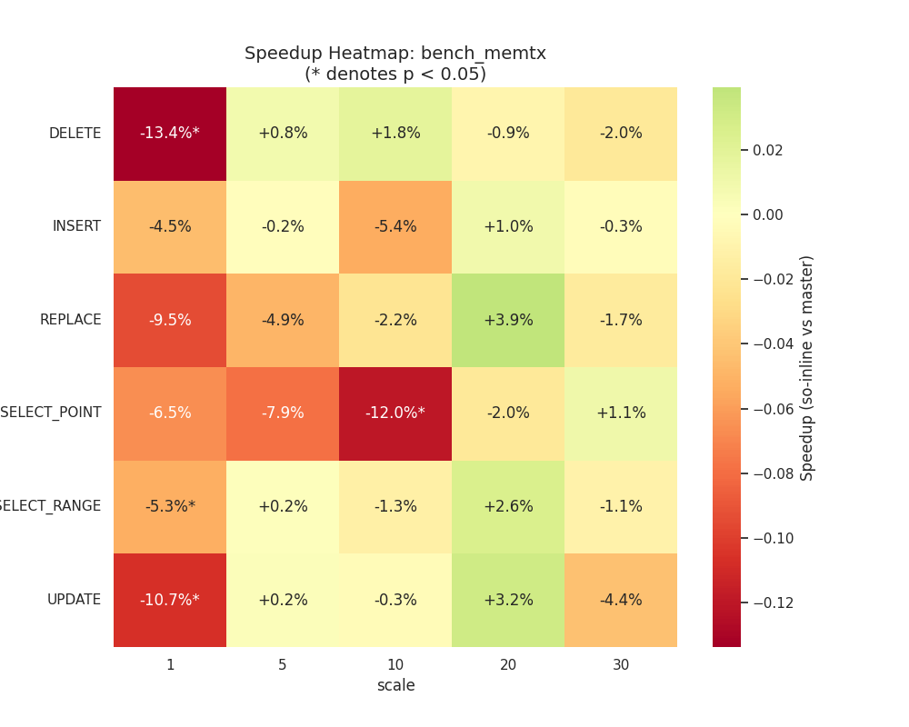
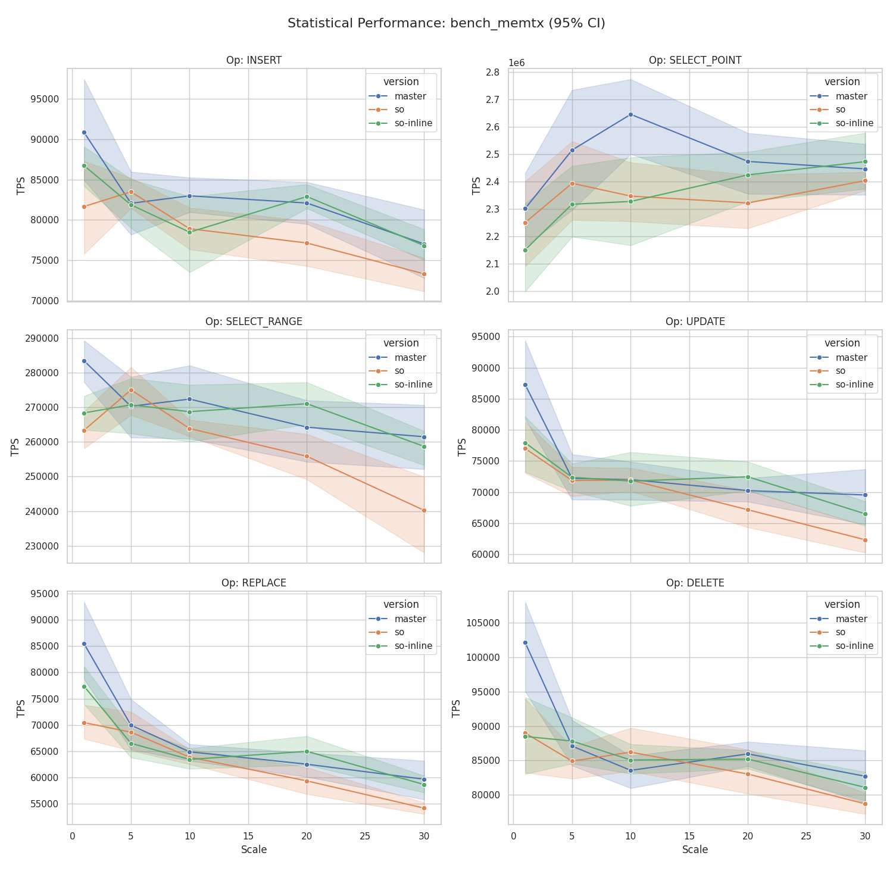
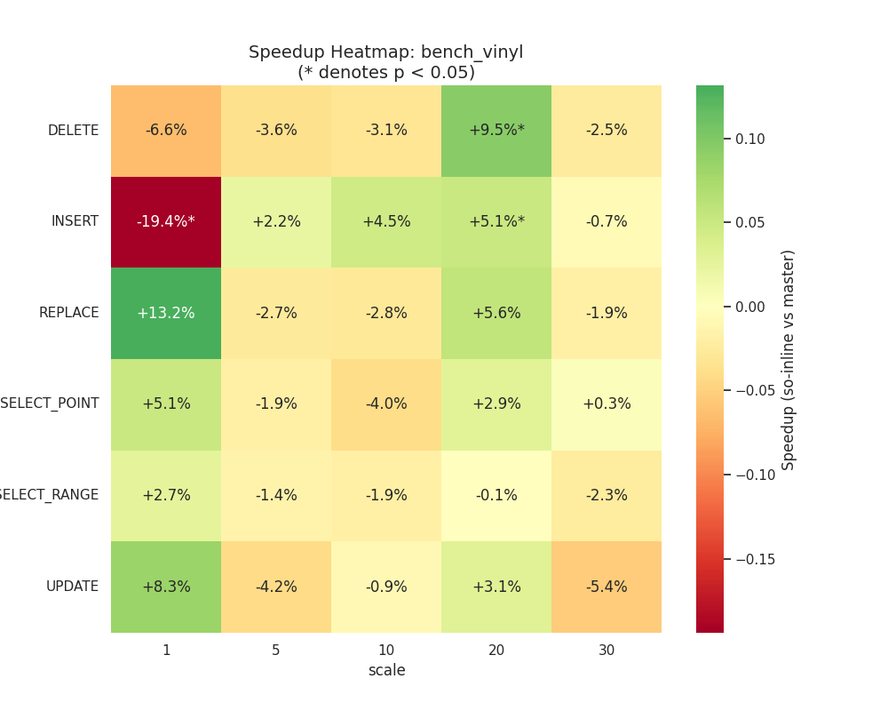
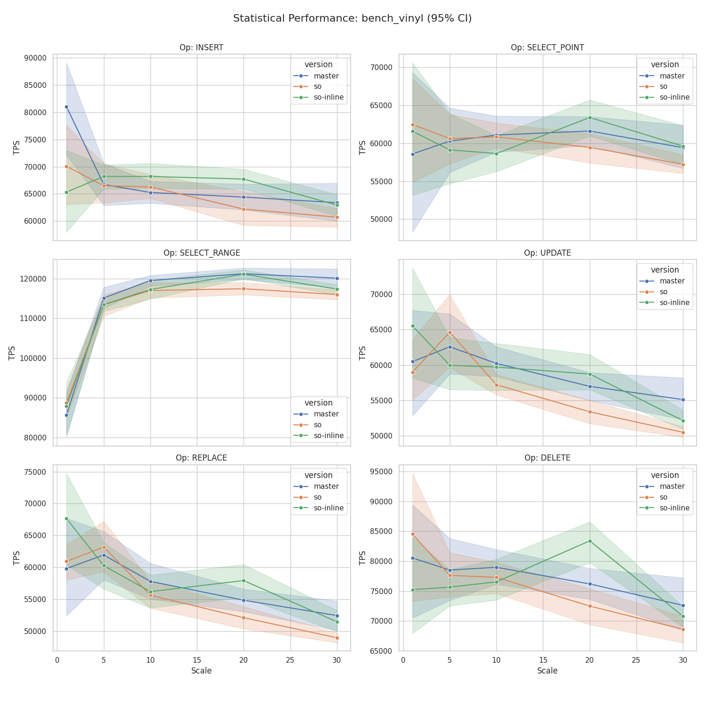

# Сравнение веток: `2.11.8-picodata` (master) vs `sort-order-support` с inline (so-inline)

## Конфигурация тестирования

| Параметр | Значение |
|---|---|
| Базовая ветка (`master`) | Tarantool 2.11.8-372-g5043aa505 |
| Целевая ветка (`so-inline`) | Tarantool 2.11.8-378-gd4a4d76d2 |
| Scales | 1, 5, 10, 20, 30 |
| Итераций на scale | 10 |
| Дата прогона | 2026-06-15 |

Оба бинарника расположены в `~/.local/bin/`. Бенчмарк `bench_sort_order.lua` применим к обеим веткам.

---

## Выводы

### bench_memtx

На малых scale (1–5) данные нестабильны (CV 10–25%) — результаты там незначимы. При scale ≥ 10 картина намного лучше, чем у `so`:

- **INSERT**: колеблется в диапазоне −5.4% … +1.0% — **ни одно значение статистически незначимо**.
- **REPLACE**: в диапазоне −4.9% … +3.9% — **незначимо**.
- **SELECT\_POINT**: −12.0% при scale 10 (значимо), но при scale 20–30 возврат к норме (+1.1% … −2.0%).
- **SELECT\_RANGE**: −1.3% … +2.6% — незначимо при scale 10–30.
- **UPDATE**: −0.3% … +3.2% — незначимо.
- **DELETE**: −2.0% … +1.8% — незначимо.

**Итог:** по memtx ветка `so-inline` **практически не отличается от master** при scale ≥ 10. Регрессия в `so` по операциям записи (INSERT −6%, UPDATE −10%) здесь отсутствует. Аномальный результат SELECT\_POINT при scale 10 изолирован и не воспроизводится на других scale.

---

### bench_vinyl

- **INSERT**: −19.4% при scale 1 (значимо), но это шум малого scale (CV 18.8%). При scale 5–30 незначимо.
- **INSERT** при scale 20: +5.1% (значимо) — лёгкое улучшение.
- **DELETE** при scale 20: +9.5% (значимо) — улучшение.
- **REPLACE**, **SELECT\_POINT**, **SELECT\_RANGE**, **UPDATE**: без значимых изменений при scale ≥ 5.

**Итог:** vinyl в `so-inline` ведёт себя на уровне master. Никакой систематической регрессии нет. Отдельные значимые точки (+9.5% DELETE, +5.1% INSERT при scale 20) скорее статистический артефакт, чем закономерность.

---

### bench_sort_order

Сравнение `master` vs `so-inline` по sort\_order важно как базовая оценка: есть ли вообще накладные расходы от нового функционала при сопоставлении с master (который sort\_order не поддерживает).

**plain (обычные индексы, sort\_order не задан):**

Практически нет значимых отличий. Ни одна операция не показывает систематической регрессии при scale 10–30.

| Операция | Scale 10 | Scale 20 | Scale 30 |
|---|---|---|---|
| INSERT | −1.3% | +1.4% | −3.9% |
| SELECT\_RANGE | −2.0% | +1.0% | −0.8% |
| SELECT\_RANGE\_REV | −4.4% | −2.7% | +1.0% |
| UPDATE | 0.0% | +1.9% | −1.8% |
| REPLACE | +3.5% | +3.2% | −2.8% |
| DELETE | +1.2% | −3.1% | −4.0% |

**all\_desc (все поля с DESC sort\_order):**

| Операция | Scale 10 | Scale 20 | Scale 30 |
|---|---|---|---|
| INSERT | +0.4% | +1.4% | −2.2% |
| SELECT\_RANGE | −2.6%* | +2.2% | −0.3% |
| SELECT\_RANGE\_REV | −3.3% | −4.9% | +0.9% |
| UPDATE | −2.2% | +1.6% | −5.4% |
| REPLACE | +1.5% | +2.3% | −3.2% |
| DELETE | +1.3% | −3.7% | −1.7% |

**mixed (смешанный порядок):**

| Операция | Scale 10 | Scale 20 | Scale 30 |
|---|---|---|---|
| INSERT | −1.6% | +5.5% | +0.1% |
| SELECT\_RANGE | −3.2%* | +3.1% | −0.4% |
| SELECT\_RANGE\_REV | −5.7% | −4.7% | +1.2% |
| UPDATE | −4.1% | +3.7% | −3.0% |
| REPLACE | −4.7% | +2.7% | −3.8% |
| DELETE | −1.1% | +2.2% | −2.1% |

**Итог:** по сравнению с master ветка `so-inline` **не показывает систематической регрессии ни в одной конфигурации sort\_order**. Отдельные значимые точки (SELECT\_RANGE −2.6% при scale 10 в all\_desc и mixed) единичны и не воспроизводятся на других scale.

---

## Общая картина

| Бенчмарк | Регрессия vs master | Вывод |
|---|---|---|
| memtx | нет систематической | Паритет с master |
| vinyl | нет систематической | Паритет с master |
| sort\_order (plain) | нет | Паритет с master |
| sort\_order (all\_desc) | нет | Паритет с master |
| sort\_order (mixed) | нет | Паритет с master |

`so-inline` устраняет регрессию, наблюдавшуюся в `so`. При scale ≥ 10 результаты статистически неотличимы от master.

---

## Графики

