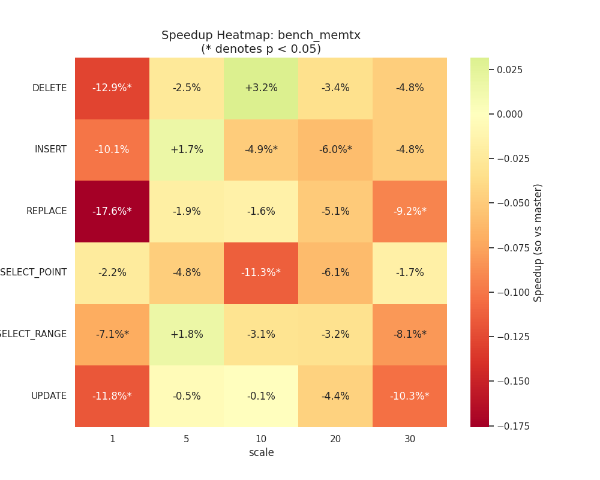
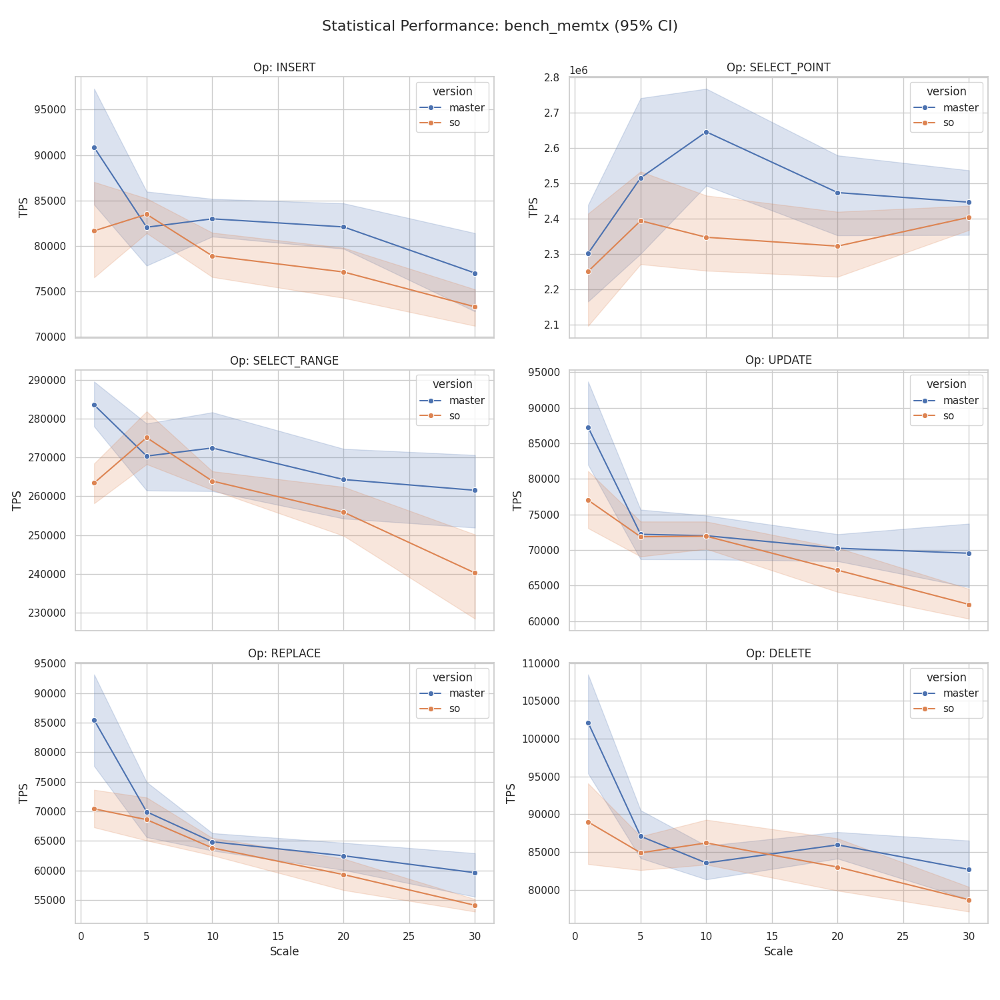
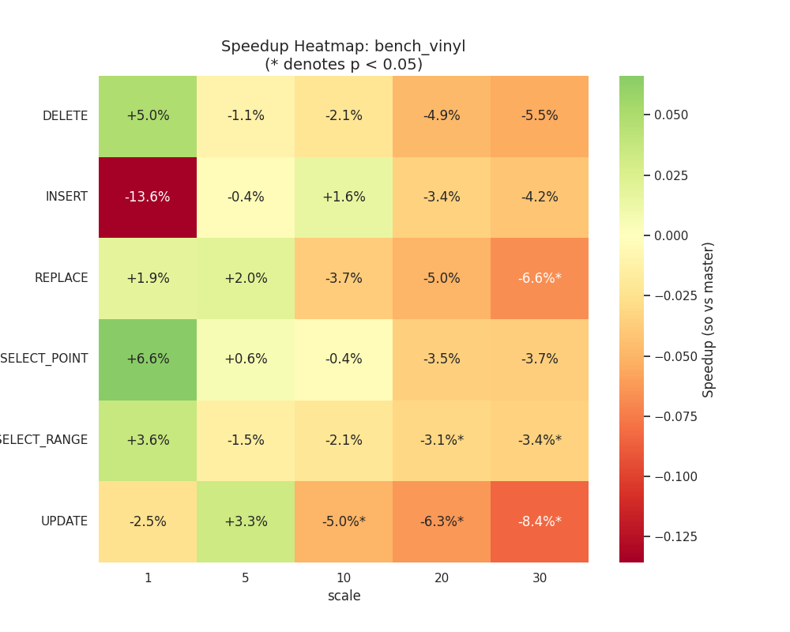
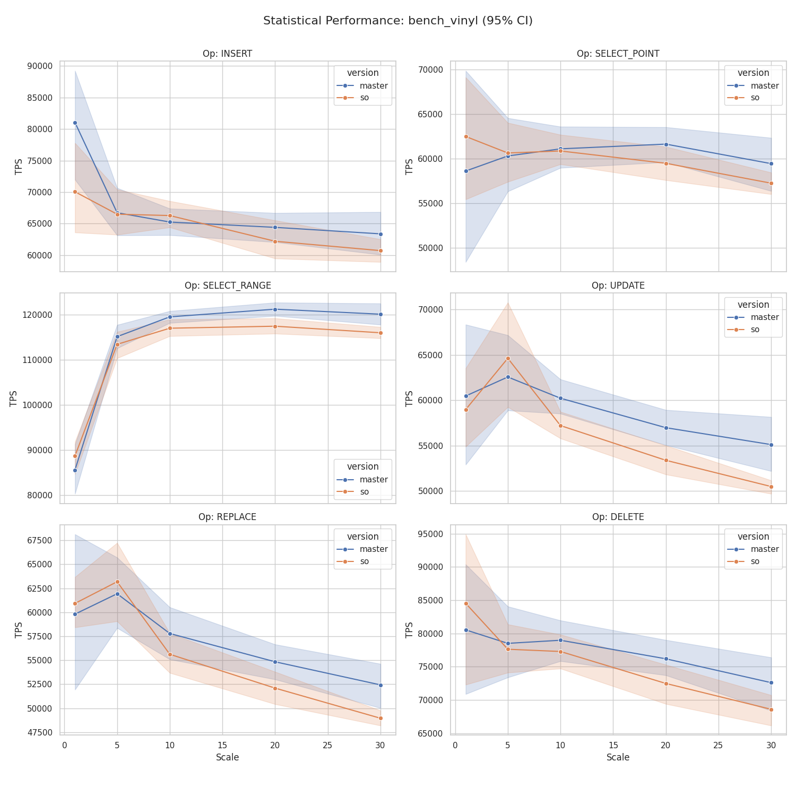

# Сравнение веток: `2.11.8-picodata` (master) vs `sort-order-support` (so)

## Конфигурация тестирования

| Параметр | Значение |
|---|---|
| Базовая ветка (`master`) | Tarantool 2.11.8-372-g5043aa505 |
| Целевая ветка (`so`) | Tarantool 2.11.8-378-gd4a4d76d2 |
| Scales | 1, 5, 10, 20, 30 |
| Итераций на scale | 10 |
| Дата прогона | 2026-06-11 |

Оба бинарника расположены в `~/.local/bin/`. Бенчмарк `bench_sort_order.lua` не применим к обеим веткам.

---

## Выводы

### bench_memtx

Ветка `so` показывает **стабильную небольшую регрессию** по записи при больших объёмах данных. На малых scale (1–5) разброс данных велик (CV 10–25%), поэтому результаты там статистически незначимы. При scale ≥ 10 картина устойчивая:

- **INSERT**: −3% … −6% (значимо при scale 10–20)
- **REPLACE**: −1.6% … −9.2% (значимо при scale 30)
- **SELECT\_POINT**: −11.3% при scale 10 (значимо), при остальных — в пределах шума
- **SELECT\_RANGE**: −3% … −8.1% (значимо при scale 1, 30)
- **UPDATE**: −0.1% … −10.3% (значимо при scale 1, 30)
- **DELETE**: +3.2% … −12.9% (при scale 10–20 статистически незначима)

**Итог:** регрессия по memtx порядка 3–9% на операциях записи при scale ≥ 10. Операции чтения (SELECT\_POINT, SELECT\_RANGE) деградируют сильнее на крайних scale, но на средних (5–20) разница в пределах шума.

---

### bench_vinyl

Картина схожа с memtx, но слабее выражена. На малых scale результаты нестабильны (CV до 28%).

- **INSERT**: при scale 1 разница −13.6%, но p=0.084 — незначима. При scale 5–20 в пределах шума.
- **REPLACE**: значимая регрессия −6.6% только при scale 30.
- **SELECT\_RANGE**: −3.1% … −3.4% при scale 20–30 (значимо).
- **UPDATE**: −5.0% … −8.4% при scale 10–30 (значимо).
- **SELECT\_POINT**, **DELETE**: без значимых изменений.

**Итог:** в vinyl регрессия умереннее. При больших объёмах (scale ≥ 20) появляется систематическое проседание UPDATE и SELECT\_RANGE на 3–8%.

---

### bench_sort_order

Этот бенчмарк проверяет работу sort\_order-индексов в трёх конфигурациях: `plain` (без sort\_order), `all_desc` (все поля DESC), `mixed` (часть DESC, часть ASC).

Ветка `so` показывает **регрессию во всех трёх конфигурациях** при scale ≥ 20. Это важный результат: конфигурация `plain` использует обычные индексы без sort\_order — значит, регрессия не специфична только для новых индексов, а системная.

**plain (обычные индексы, sort_order не задан):**

| Операция | Scale 10 | Scale 20 | Scale 30 |
|---|---|---|---|
| INSERT | −3.0% | −8.6%* | −8.3% |
| SELECT\_RANGE | −3.8%* | −4.5%* | −4.5%* |
| SELECT\_RANGE\_REV | −4.5%* | −7.8%* | −7.2%* |
| UPDATE | −5.0% | −8.4%* | −8.1%* |
| REPLACE | −0.1% | −5.9%* | −8.3%* |
| DELETE | −3.1% | −7.3%* | −6.2% |

**all\_desc (все поля с DESC sort\_order):**

| Операция | Scale 10 | Scale 20 | Scale 30 |
|---|---|---|---|
| INSERT | −4.9% | −6.6%* | −5.3% |
| SELECT\_RANGE | −4.8%* | −3.0% | −3.8%* |
| SELECT\_RANGE\_REV | −3.8%* | −6.5%* | −6.9%* |
| UPDATE | −5.8% | −6.4%* | −10.9%* |
| REPLACE | −2.4% | −9.5%* | −7.6%* |
| DELETE | −6.4%* | −8.1%* | −5.2% |

**mixed (смешанный порядок):**

| Операция | Scale 10 | Scale 20 | Scale 30 |
|---|---|---|---|
| INSERT | −3.2% | −6.7% | −7.2% |
| SELECT\_RANGE | −3.1%* | −2.6% | −4.3%* |
| SELECT\_RANGE\_REV | −3.2%* | −7.4%* | −7.4%* |
| UPDATE | −5.6% | −6.8%* | −7.9% |
| REPLACE | −6.5% | −4.0% | −7.4% |
| DELETE | −5.8%* | −3.7% | −6.5% |

**Итог:** регрессия в `so` при использовании sort\_order-индексов составляет 4–11% при scale ≥ 20. Поскольку она присутствует и в конфигурации `plain` (без sort\_order), это говорит о системном изменении в ветке, а не о накладных расходах самих новых индексов.

---

## Общая картина

| Движок/бенчмарк | Диапазон регрессии (scale ≥ 10, значимые) | Тенденция |
|---|---|---|
| memtx | 3–11% | Нарастает с scale |
| vinyl | 3–8% | Нарастает с scale |
| sort\_order (plain) | 4–9% | Нарастает с scale |
| sort\_order (all\_desc) | 4–11% | Нарастает с scale |
| sort\_order (mixed) | 3–7% | Нарастает с scale |

Общий паттерн: на малых объёмах (scale 1–5) разница статистически незначима. При scale ≥ 10–20 появляется систематическая регрессия 4–11%, которая нарастает с объёмом данных. Это характерно для изменений, влияющих на кеширование или на стоимость операций с деревьями (B-tree traversal, COW, compaction).

---

## Графики

