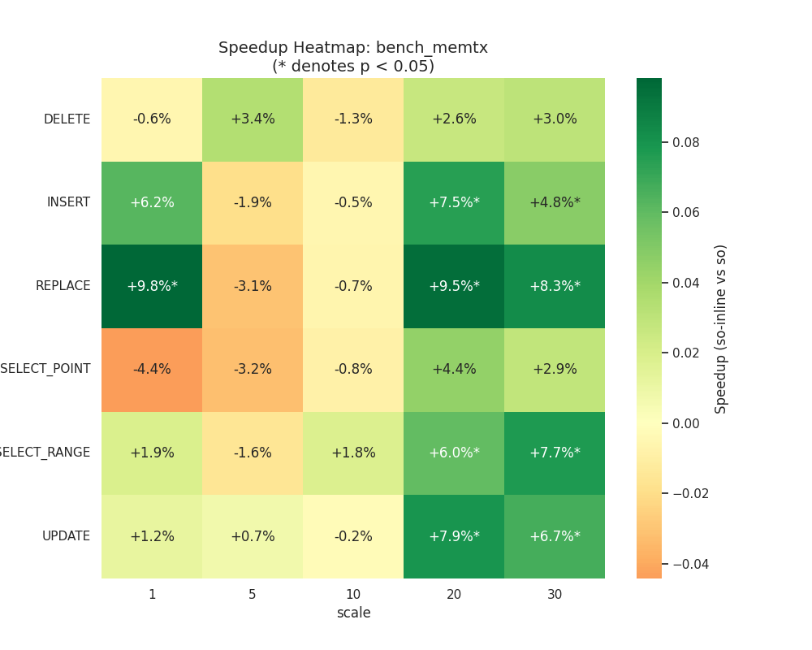
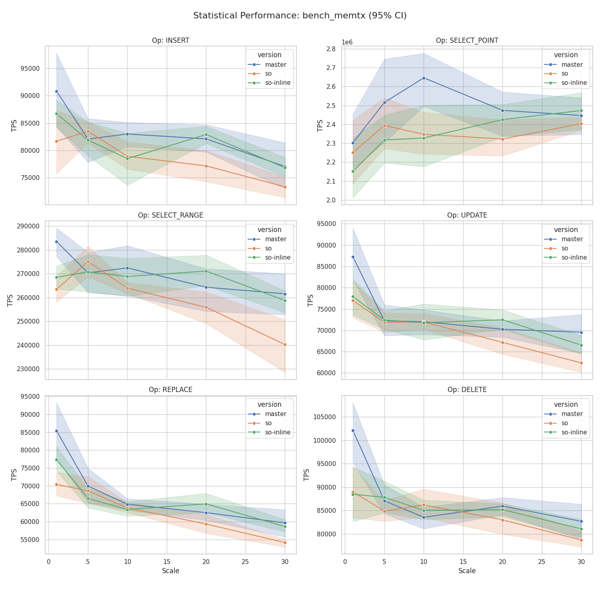
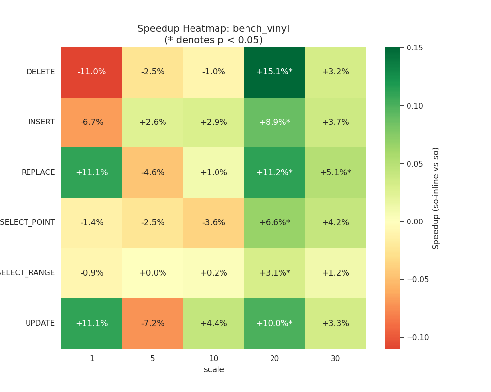
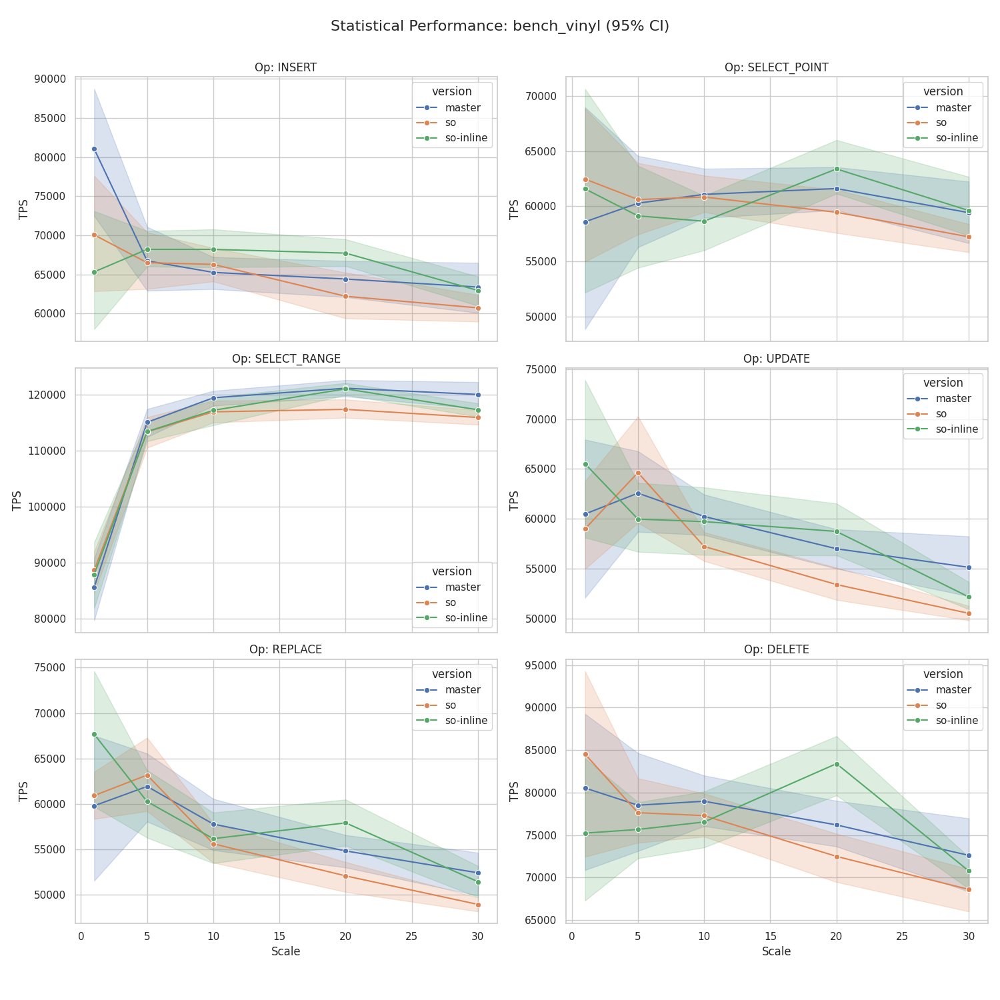
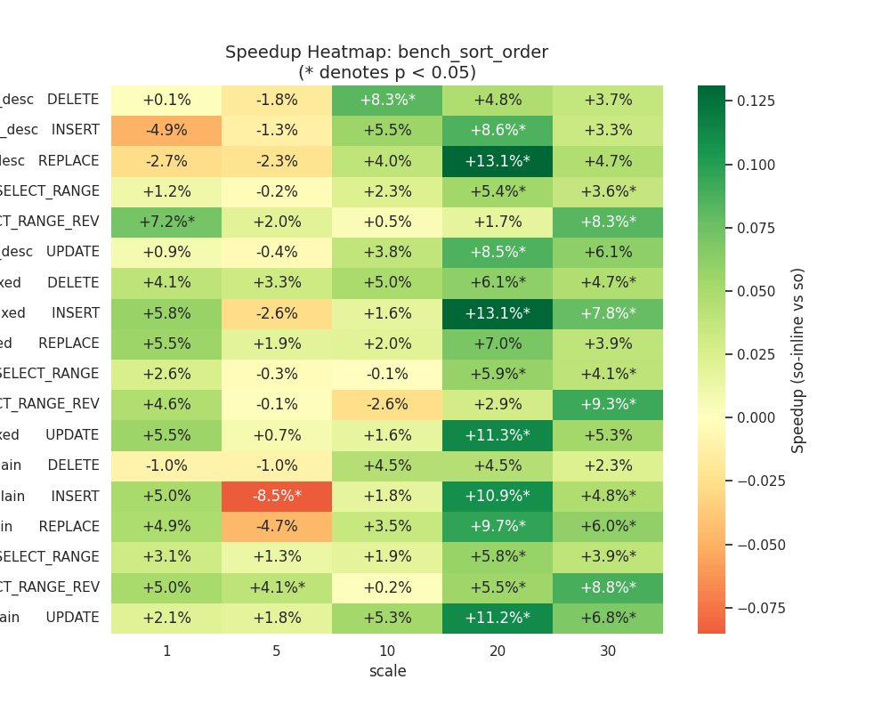
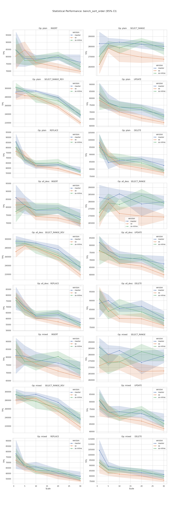

# Сравнение веток: `sort-order-support` (so) vs `sort-order-support` с inline (so-inline)

## Конфигурация тестирования

| Параметр | Значение |
|---|---|
| Базовая ветка (`so`) | Tarantool 2.11.8-378-gd4a4d76d2 |
| Целевая ветка (`so-inline`) | Tarantool 2.11.8-378-gd4a4d76d2 |
| Scales | 1, 5, 10, 20, 30 |
| Итераций на scale | 10 |

Обе ветки поддерживают sort\_order. Сборки имеют одинаковый базовый коммит, разница только в применении inline/always\_inline к критическим функциям.

---

## Выводы

### bench_memtx

`so-inline` показывает **значимое улучшение** по операциям записи при больших объёмах данных — именно там, где `so` проигрывала master.

| Операция | Scale 10 | Scale 20 | Scale 30 |
|---|---|---|---|
| INSERT | −0.5% | **+7.5%\*** | **+4.8%\*** |
| REPLACE | −0.7% | **+9.5%\*** | **+8.3%\*** |
| SELECT\_RANGE | +1.8% | **+6.0%\*** | **+7.7%\*** |
| SELECT\_POINT | −0.8% | +4.4% | +2.9% |
| UPDATE | −0.2% | **+7.9%\*** | **+6.7%\*** |
| DELETE | −1.3% | +2.6% | +3.0% |

**Итог:** начиная со scale 20 `so-inline` стабильно быстрее `so` на 5–10% по операциям INSERT, REPLACE, UPDATE, SELECT\_RANGE. Именно эти операции показывали регрессию `so` относительно master — inline устраняет её.

---

### bench_vinyl

Аналогичная картина: улучшение концентрируется на scale 20.

| Операция | Scale 10 | Scale 20 | Scale 30 |
|---|---|---|---|
| INSERT | +2.9% | **+8.9%\*** | +3.7% |
| REPLACE | +1.0% | **+11.2%\*** | **+5.1%\*** |
| SELECT\_RANGE | +0.2% | **+3.1%\*** | +1.2% |
| SELECT\_POINT | −3.6% | **+6.6%\*** | +4.2% |
| UPDATE | +4.4% | **+10.0%\*** | +3.3% |
| DELETE | −1.0% | **+15.1%\*** | +3.2% |

**Итог:** при scale 20 все операции в `so-inline` значимо быстрее `so`. При scale 30 улучшение сохраняется, но статистически не всегда достигает порога p < 0.05 из-за большего разброса vinyl.

---

### bench_sort_order

Inline даёт наиболее выраженный эффект именно в sort\_order-операциях — что логично, т.к. инлайнинг направлен на горячие пути в коде сравнения ключей.

**plain (обычные индексы):**

| Операция | Scale 10 | Scale 20 | Scale 30 |
|---|---|---|---|
| INSERT | +1.8% | **+10.9%\*** | **+4.8%\*** |
| SELECT\_RANGE | +1.9% | **+5.8%\*** | **+3.9%\*** |
| SELECT\_RANGE\_REV | +0.2% | **+5.5%\*** | **+8.8%\*** |
| UPDATE | +5.3% | **+11.2%\*** | **+6.8%\*** |
| REPLACE | +3.5% | **+9.7%\*** | **+6.0%\*** |
| DELETE | +4.5% | +4.5% | +2.3% |

**all\_desc (все поля DESC):**

| Операция | Scale 10 | Scale 20 | Scale 30 |
|---|---|---|---|
| INSERT | +5.5% | **+8.6%\*** | +3.3% |
| SELECT\_RANGE | +2.3% | **+5.4%\*** | **+3.6%\*** |
| SELECT\_RANGE\_REV | +0.5% | +1.7% | **+8.3%\*** |
| UPDATE | +3.8% | **+8.5%\*** | +6.1% |
| REPLACE | +4.0% | **+13.1%\*** | +4.7% |
| DELETE | **+8.3%\*** | +4.8% | +3.7% |

**mixed (смешанный порядок):**

| Операция | Scale 10 | Scale 20 | Scale 30 |
|---|---|---|---|
| INSERT | +1.6% | **+13.1%\*** | **+7.8%\*** |
| SELECT\_RANGE | −0.1% | **+5.9%\*** | **+4.1%\*** |
| SELECT\_RANGE\_REV | −2.6% | +2.9% | **+9.3%\*** |
| UPDATE | +1.6% | **+11.3%\*** | +5.3% |
| REPLACE | +2.0% | +7.0% | +3.9% |
| DELETE | +5.0% | **+6.1%\*** | **+4.7%\*** |

**Итог:** `so-inline` стабильно быстрее `so` во всех трёх конфигурациях на 4–13% при scale ≥ 20. Улучшение статистически значимо по большинству операций. Конфигурация `plain` показывает такой же выигрыш, как `all_desc` и `mixed` — что подтверждает системную природу оптимизации (горячий путь в tree-сравнении, а не специфика sort\_order).

---

## Общая картина

| Бенчмарк | Улучшение so-inline vs so (scale ≥ 20) |
|---|---|
| memtx | +5% … +10% по записи и SELECT\_RANGE |
| vinyl | +3% … +15% по всем операциям |
| sort\_order (plain) | +4% … +11% |
| sort\_order (all\_desc) | +4% … +13% |
| sort\_order (mixed) | +4% … +13% |

Применение inline/always\_inline к функциям сравнения ключей устраняет регрессию `so` относительно master и дополнительно даёт прирост 5–13% при больших объёмах данных (scale ≥ 20).

---

## Графики

